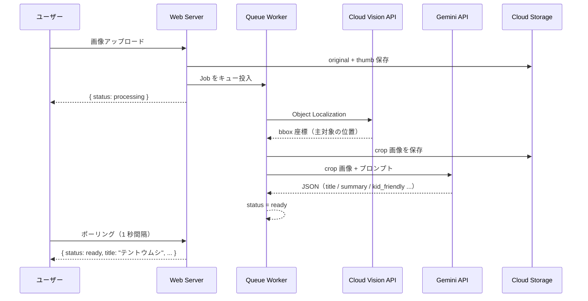

# LensClip

**散歩が、冒険になる。**

「これなぁに？」——公園の虫、散歩中の草花、空を飛ぶ鳥。
写真を1枚撮るだけで、子どもにわかる言葉で答えが届く。親子で使う、デジタル図鑑アプリ。

発見は日付・カテゴリ・地図で蓄積されていき、使うたびに**世界にひとつの図鑑**が育つ。

**デモ**: https://lensclip.up.railway.app/

---

## AI パイプライン

Gemini に画像をそのまま渡すのではなく、まず Vision API で主対象を bbox で切り出してから渡す2段構えの設計にしています。背景ノイズを排除することで同定精度が上がり、bbox が取れない場合は元画像にフォールバックするため、どちらに転んでも止まらない構造です。



---

## 設計の判断

**冪等 Job で安全なリトライ**
`AnalyzeObservationJob` は status が `processing` 以外なら即リターン。分散キューでは重複実行が起きうるため、冪等性を最初から設計に組み込んだ。ユーザーのリトライも status を `processing` に戻してから再投入する一方向設計にしている。

**環境依存をゼロにする抽象化**
ストレージは `Storage` ファサードで実装し `FILESYSTEM_DISK` 一本で GCS／ローカルを切り替え。Google Cloud 認証は Application Default Credentials で Vision / Gemini / GCS / TTS を統一。TTS の生成ファイルも同じ `Storage` ファサード経由でキャッシュし、スケジュールコマンドで TTL 管理する。コードを変えずにローカル開発から本番まで動く。

**操作者とエンドユーザーの分離**
アプリを操作するのは親、コンテンツを受け取るのは子どもという二層設計。この前提が UI（シンプルな導線・大きなタッチターゲット）とコンテンツ（`kid_friendly` フィールド）の両方に一貫して影響している。

---

## スタック


| カテゴリ | 技術 | 選定理由 |
|---------|------|---------|
| Backend | Laravel 12 + Inertia.js | API 分離なしで React を使える。認証・バリデーションは Laravel に任せ、フロントの型安全性だけ取る |
| Frontend | React + TypeScript | Props の型がサーバ側スキーマと自然に揃う。`any` 禁止を前提にすると型安全性の恩恵が出やすい |
| 画像認識 | Cloud Vision API | Object Localization に特化。分類や説明はさせない |
| 説明生成 | Gemini API | マルチモーダル + JSON mode で構造化出力。`kid_friendly` フィールドをプロンプトで強制できる |
| 音声合成 | Google Cloud TTS | 英語名の読み上げ。TTL キャッシュで同一単語の重複 API 呼び出しを排除 |
| ストレージ | Google Cloud Storage / ローカル | `FILESYSTEM_DISK` 一本で切り替え。dev と prod でコードを変えない |
| Queue | Redis + Laravel Jobs | 非同期処理。冪等 Job で重複実行・リトライを安全にハンドル |
| Auth | Laravel Breeze + Socialite | メール認証 + Google OAuth を最小実装で追加 |
| Deploy | Railway | MySQL + Redis + Volume を一元管理。インフラより機能に集中する選択 |

---

## Quick Start

```bash
cp .env.example .env           # API キーを設定
./vendor/bin/sail up -d
./vendor/bin/sail artisan migrate && ./vendor/bin/sail artisan storage:link
./vendor/bin/sail npm run dev
```

詳細は [Setup Guide](docs/setup.md) を参照してください。

---

## License

MIT
