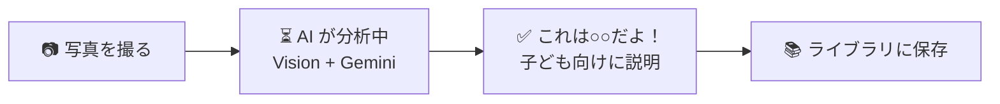
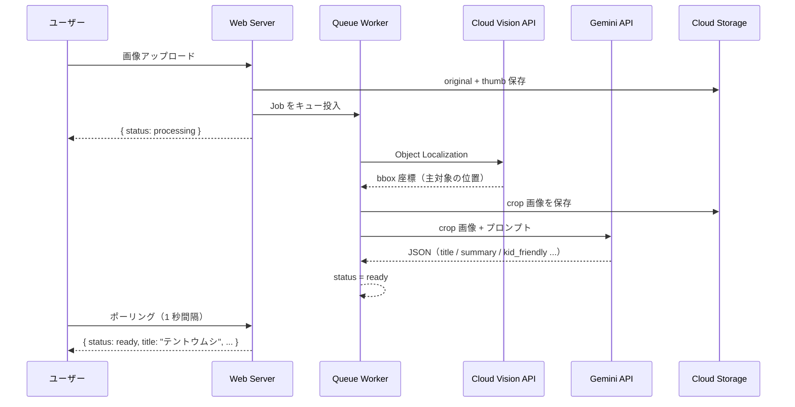

# LensClip — 子どもの「これなぁに？」を AI が答えてくれるアプリ


**デモ**: https://lensclip.up.railway.app/

---

## Overview

子どもが見つけた虫・花・どうぶつを写真に撮ると、AI が「これはなぁに？」を子ども向けに説明してくれる Web アプリです。
親子で一緒に使えるデジタル図鑑として、撮った発見を保存・検索できるライブラリ機能も備えています。

**対象**: 3〜6 歳の子どもを持つ親
**設計思想**: 操作は親、コンテンツは子どもへ ── 読み聞かせに使えるテキストを AI が生成します。

---

## How it Works



---

## AI Pipeline

写真 1 枚から「何か」を当てて説明するために、**2 つの AI を直列で使う**設計を採用しています。



**なぜ 2 段構えにするか？**
Vision API で主対象を bbox で切り出してから Gemini に渡すことで、背景ノイズを排除し同定精度を向上させています。
また責務を分離することで、将来のモデル差し替えにも対応しやすい設計になっています。

---

## Tech Stack

| カテゴリ | 技術 | 選定理由 |
|---------|------|---------|
| Backend | Laravel 12 + Inertia.js | 堅牢な MVC + SPA 的 UX を最小構成で実現 |
| Frontend | React + TypeScript | 型安全な UI 開発、Inertia による SSR 対応 |
| AI（検出） | Cloud Vision API | Object Localization で主対象を bbox 取得 |
| AI（説明） | Gemini API | マルチモーダル + JSON mode で構造化出力 |
| ストレージ | Google Cloud Storage | 本番スケール対応。サービスアカウント 1 本で Vision / Gemini / GCS を統合 |
| Queue | Redis + Laravel Jobs | 非同期 AI 処理・冪等リトライ設計 |
| Auth | Laravel Breeze + Socialite | メール認証 + Google OAuth を最小コストで実装 |
| Deploy | Railway | Docker ベースの即時デプロイ、MySQL + Redis + Volume を一元管理 |

---

## Key Design Decisions

### 1. 非同期 AI パイプライン + status machine

AI 分析は 3〜10 秒かかるためリクエスト同期処理は避けました。
`processing → ready / failed` の status machine でフロントがポーリングし、
Job を冪等設計（status が processing 以外なら何もしない）にしてリトライを安全にしています。

### 2. Google Cloud を一貫して活用

ストレージ（GCS）・物体検出（Vision API）・説明生成（Gemini API）をサービスアカウント 1 本で統合。
企画・技術選定・インフラ構成まで一貫して設計しました。

### 3. 子ども向け UX の二層設計

エンドユーザーは 3〜6 歳の子ども、操作者は親という二層構造を意識しています。
AI が生成する `kid_friendly` テキストは「親が読み聞かせる」想定の文体で、
処理中アニメーション + 「しらべています...」で子どもが待てる UX にしています。

---

## Features

- **撮影・アップロード** ── カメラ撮影またはファイル選択
- **AI 分析** ── Vision API で主対象を Crop → Gemini で同定・子ども向け説明生成
- **候補カード** ── 複数候補をタップで切り替え（信頼度スコア付き）
- **ライブラリ** ── グリッド表示・日付/カテゴリ/マップビュー・タグフィルタ・検索
- **タグ管理** ── AI 自動付与 + 手動追加
- **失敗時リトライ** ── 分析失敗時にワンタップで再実行
- **管理者機能** ── Gemini モデルの切り替え・ログ閲覧

---

## Docs

| ドキュメント | 内容 |
|------------|------|
| [PRD](docs/prd.md) | 製品要件・ターゲット・MVP スコープ |
| [UX Flow](docs/ux-flow.md) | 画面遷移・状態管理 |
| [API Spec](docs/api-spec.md) | エンドポイント仕様 |
| [DB Schema](docs/db-schema.md) | テーブル設計 |
| [AI Pipeline](docs/ai-pipeline.md) | Vision→Crop→Gemini パイプライン詳細 |
| [AI Models](docs/ai-models.md) | Gemini モデル許可リスト |
| [Setup Guide](docs/setup.md) | ローカル環境構築手順 |
| [Deployment](docs/deployment.md) | Railway デプロイ手順 |

---

## Quick Start

```bash
cp .env.example .env           # API キーを設定
./vendor/bin/sail up -d
./vendor/bin/sail artisan migrate && ./vendor/bin/sail artisan storage:link
./vendor/bin/sail npm run dev
```

詳細は [Setup Guide](docs/setup.md) を参照してください。

---

## License

MIT
