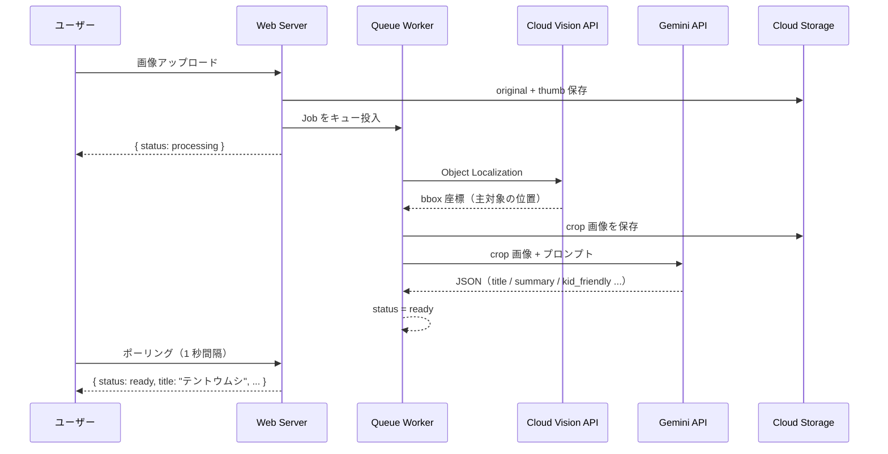

# LensClip

**散歩が、冒険になる。**

「これなぁに？」
その一言から、会話が始まる。

写真を1枚撮るだけで、子どもにわかる言葉で教えてくれる。
親子で使う、デジタル図鑑アプリ。

**デモ**: https://lensclip.up.railway.app/

---

## こんな瞬間のために

公園で見つけた虫、散歩中に気になった草花、空を飛ぶ鳥の名前——

「なんで？」「これなに？」と聞かれたとき、
ちゃんと答えてあげられる。その瞬間を、アプリが一緒に作ります。

何気ない散歩が、忘れられない思い出に変わる。

---

## 子どもには、自分だけの図鑑ができる

撮った発見は、すべてライブラリに残ります。
日付・カテゴリ・タグで整理されていくから、
使うたびに**世界にひとつだけの図鑑**が育っていく。

---

## 使い方は、写真を撮るだけ

```
📷 気になるものを撮る
        ↓
📖 子どもにわかる言葉で説明が届く
        ↓
📚 ライブラリに保存されて、図鑑が育つ
```

説明は子どもにわかる言葉で届きます。
画面を一緒に見ながら、会話のきっかけにしてください。

---

## できること

- **その場で調べる** ── カメラでパシャっと撮るだけ
- **複数の候補が出る** ── 「これかも」を子どもと一緒に選べる
- **図鑑として残る** ── 日付・カテゴリ・地図で振り返れる
- **タグをつけられる** ── 「こうえん」「おきにいり」など自由に整理
- **調べなおせる** ── もう一回確認したいときはワンタップ

---

## AI パイプライン

Gemini に画像をそのまま渡すのではなく、まず Vision API で主対象を bbox で切り出してから渡す2段構えの設計にしています。背景ノイズを排除することで同定精度が上がり、bbox が取れない場合は元画像にフォールバックするため、どちらに転んでも止まらない構造です。



---

## 設計の判断

**冪等 Job で安全なリトライ**
`AnalyzeObservationJob` は status が `processing` 以外なら即リターン。分散キューでは重複実行が起きうるため、冪等性を最初から設計に組み込んだ。ユーザーのリトライも status を `processing` に戻してから再投入する一方向設計にしている。

**環境依存をゼロにする抽象化**
ストレージは `Storage` ファサードで実装し `FILESYSTEM_DISK` 一本で GCS／ローカルを切り替え。Google Cloud 認証は Application Default Credentials で Vision / Gemini / GCS を統一。コードを変えずにローカル開発から本番まで動く。

**操作者とエンドユーザーの分離**
アプリを操作するのは親、コンテンツを受け取るのは子どもという二層設計。この前提が UI（シンプルな導線・大きなタッチターゲット）とコンテンツ（`kid_friendly` フィールド）の両方に一貫して影響している。

---

## スタック


| カテゴリ | 技術 | 選定理由 |
|---------|------|---------|
| Backend | Laravel 12 + Inertia.js | 堅牢な MVC + SPA 的 UX を最小構成で実現 |
| Frontend | React + TypeScript | 型安全な UI 開発、Inertia による SSR 対応 |
| 画像認識 | Cloud Vision API | Object Localization で主対象を bbox 取得 |
| 説明生成 | Gemini API | マルチモーダル + JSON mode で構造化出力 |
| ストレージ | Google Cloud Storage / ローカル | `FILESYSTEM_DISK` で切り替え可能。GCS 使用時はサービスアカウント 1 本で Vision / Gemini / GCS を統合 |
| Queue | Redis + Laravel Jobs | 非同期処理・冪等リトライ設計 |
| Auth | Laravel Breeze + Socialite | メール認証 + Google OAuth を最小コストで実装 |
| Deploy | Railway | Docker ベースの即時デプロイ、MySQL + Redis + Volume を一元管理 |

---

## Quick Start

```bash
cp .env.example .env           # API キーを設定
./vendor/bin/sail up -d
./vendor/bin/sail artisan migrate && ./vendor/bin/sail artisan storage:link
./vendor/bin/sail npm run dev
```

詳細は [Setup Guide](docs/setup.md) を参照してください。

---

## License

MIT
