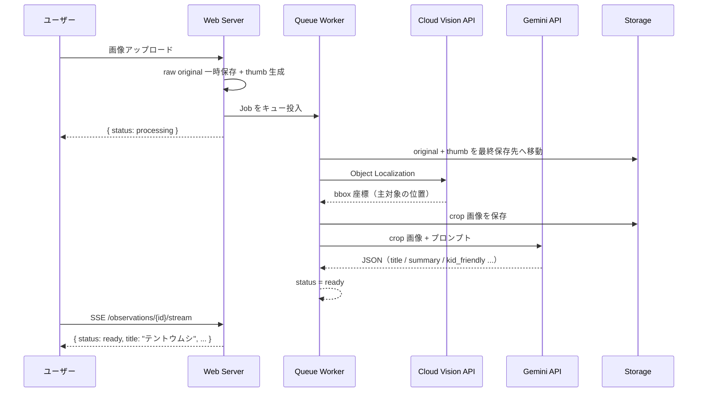

# LensClip 📷

**散歩が、冒険になる。**

「これなぁに？」——公園の虫、散歩中の草花、空を飛ぶ鳥。
写真を1枚撮るだけで、子どもにわかる言葉で答えが届く。親子で使う、デジタル図鑑アプリ。

発見は日付・カテゴリ・地図で蓄積されていき、使うたびに**世界にひとつの図鑑**が育つ。

お子さまの「これなあに」という好奇心を大切に育みながら、親子で過ごすあたたかいコミュニケーションの時間をサポートいたします。

**Demo**: https://lensclip.up.railway.app/

---

## 機能

| 機能                 | 概要                                                                                     |
| -------------------- | ---------------------------------------------------------------------------------------- |
| 📷 撮影・アップロード | カメラ or ファイル選択、位置情報取得、画像正規化・サムネイル生成・EXIF 除去              |
| 🔍 AI 同定            | Vision API で主対象を検出 → bbox 合成スコアで選定 → Gemini で同定・説明生成              |
| 🔊 英名読み上げ       | Cloud TTS API で同定結果の英名を発音（英単語学習、キャッシュ付き）                       |
| 📚 ライブラリ         | グリッド表示、全文検索、タグフィルタ、カテゴリビュー、マップビュー                       |
| 🏷️ タグ・カテゴリ     | AI 自動付与 + 手動追加・修正                                                             |
| ⚡ リアルタイム通知   | SSE で分析完了を即時反映（ポーリング不要）                                               |
| 🔐 認証               | Breeze (Email/Password) + Google OAuth (Socialite)                                       |
| ⚙️ 管理画面           | ログ閲覧、Gemini モデル切替（allowlist 制御）                                            |

---

## アーキテクチャ

| Layer    | Stack                                                     |
| -------- | --------------------------------------------------------- |
| Backend  | Laravel 12, PHP 8.5, MySQL                                |
| Frontend | Inertia.js v2, React 18, TypeScript, Tailwind CSS v3      |
| AI / ML  | Google Cloud Vision API (Object Localization), Gemini API |
| TTS      | Google Cloud Text-to-Speech API                           |
| Storage  | GCS / local public                                        |
| Queue    | database default / Redis optional                         |
| Auth     | Laravel Breeze, Laravel Socialite                         |
| Infra    | Docker (Laravel Sail), Railway                            |

### AI パイプライン

```mermaid
sequenceDiagram
    participant User as ユーザー
    participant App as Web Server
    participant Q as Queue Worker
    participant Vision as Cloud Vision API
    participant Gemini as Gemini API
    participant Storage as Storage

    User->>App: 画像アップロード
    App->>App: raw original 一時保存 + thumb 生成
    App->>Q: Job をキュー投入
    App-->>User: { status: processing }

    Q->>Storage: original + thumb を最終保存先へ移動
    Q->>Vision: Object Localization
    Vision-->>Q: bbox 座標（主対象の位置）
    Q->>Storage: crop 画像を保存
    Q->>Gemini: crop 画像 + プロンプト
    Gemini-->>Q: JSON（title / summary / kid_friendly ...）
    Q-->>Q: status = ready

    User->>App: SSE /observations/{id}/stream
    App-->>User: { status: ready, title: "テントウムシ", ... }
```

---

## 技術的ハイライト

**Vision API bbox 選定**: 複数検出オブジェクトから、信頼度・面積・中心寄りを使った合成スコアで1件を選定。bbox未検出時は原画像へフォールバック。

**Gemini JSON 出力**: `response_mime_type: application/json` 指定。候補データ（名前、英名、confidence、子供向け説明、見分けポイント、豆知識）を生成。カテゴリは `config/categories.php` から動的にプロンプト注入。

**SSE リアルタイム通知**: `text/event-stream` でステータスをpush。処理中は heartbeat を返し、完了・失敗・タイムアウトを画面へ通知。

**非同期 Queue 処理**: Vision → Crop → Gemini の処理を冪等実行。状態管理 (`processing` → `ready` / `failed`) + ユーザー操作リトライ。

**TTSキャッシュ**: テキスト・音声・速度から生成したキーで Storage（GCS / local）に保存。

**ストレージ抽象化**: 環境変数による GCS / local の切替。画像・音声・サムネイルのI/Oを単一Facadeへ統合。

---

## 開発ドキュメント

| ドキュメント                                                   | 内容                                 |
| -------------------------------------------------------------- | ------------------------------------ |
| [docs/prd.md](docs/prd.md)                                     | プロダクト定義、ユースケース、UX原則 |
| [docs/ux-flow.md](docs/ux-flow.md)                             | 画面遷移図、UI 状態                  |
| [docs/api-spec.md](docs/api-spec.md)                           | API エンドポイント仕様               |
| [docs/db-schema.md](docs/db-schema.md)                         | ER図、テーブル定義                   |
| [docs/ai-pipeline.md](docs/ai-pipeline.md)                     | Vision / Gemini / TTS 処理フロー     |
| [docs/ai-models.md](docs/ai-models.md)                         | Gemini モデル allowlist の運用方針   |
| [docs/engineering-standards.md](docs/engineering-standards.md) | アーキテクチャ原則、テスト、PRゲート |
| [docs/laravel-conventions.md](docs/laravel-conventions.md)     | Laravel コード規約                   |
| [docs/setup.md](docs/setup.md)                                 | 開発環境構築手順                     |
| [docs/deploy.md](docs/deploy.md)                               | Railway デプロイ手順                 |

---
