```mermaid
sequenceDiagram
    participant User as ユーザー
    participant App as Web Server
    participant Q as Queue Worker
    participant Vision as Cloud Vision API
    participant Gemini as Gemini API
    participant GCS as Cloud Storage

    User->>App: 画像アップロード
    App->>GCS: original + thumb 保存
    App->>Q: Job をキュー投入
    App-->>User: { status: processing }

    Q->>Vision: Object Localization
    Vision-->>Q: bbox 座標（主対象の位置）
    Q->>GCS: crop 画像を保存
    Q->>Gemini: crop 画像 + プロンプト
    Gemini-->>Q: JSON（title / summary / kid_friendly ...）
    Q-->>Q: status = ready

    User->>App: ポーリング（1 秒間隔）
    App-->>User: { status: ready, title: "テントウムシ", ... }
```

# LensClip

**散歩が、冒険になる。**

「これなぁに？」
その一言から、会話が始まる。

写真を1枚撮るだけで、子どもにわかる言葉で教えてくれる。
親子で使う、デジタル図鑑アプリ。

**デモ**: https://lensclip.up.railway.app/

---

## こんな瞬間のために

公園で見つけた虫、散歩中に気になった草花、空を飛ぶ鳥の名前——

「なんで？」「これなに？」と聞かれたとき、
ちゃんと答えてあげられる。その瞬間を、アプリが一緒に作ります。

何気ない散歩が、忘れられない思い出に変わる。

---

## 子どもには、自分だけの図鑑ができる

撮った発見は、すべてライブラリに残ります。
日付・カテゴリ・タグで整理されていくから、
使うたびに**世界にひとつだけの図鑑**が育っていく。

---

## 使い方は、写真を撮るだけ

```
📷 気になるものを撮る
        ↓
📖 子どもにわかる言葉で説明が届く
        ↓
📚 ライブラリに保存されて、図鑑が育つ
```

説明は「読み聞かせできる」文体で届きます。
画面を見せながら、一緒に読んであげてください。

---

## できること

- **その場で調べる** ── カメラでパシャっと撮るだけ
- **複数の候補が出る** ── 「これかも」を子どもと一緒に選べる
- **図鑑として残る** ── 日付・カテゴリ・地図で振り返れる
- **タグをつけられる** ── 「こうえん」「おきにいり」など自由に整理
- **調べなおせる** ── もう一回確認したいときはワンタップ

---

---

## For Developers

ここからは実装の話です。


### Tech Stack

| カテゴリ | 技術 | 選定理由 |
|---------|------|---------|
| Backend | Laravel 12 + Inertia.js | 堅牢な MVC + SPA 的 UX を最小構成で実現 |
| Frontend | React + TypeScript | 型安全な UI 開発、Inertia による SSR 対応 |
| 画像認識 | Cloud Vision API | Object Localization で主対象を bbox 取得 |
| 説明生成 | Gemini API | マルチモーダル + JSON mode で構造化出力 |
| ストレージ | Google Cloud Storage | 本番スケール対応。サービスアカウント 1 本で Vision / Gemini / GCS を統合 |
| Queue | Redis + Laravel Jobs | 非同期処理・冪等リトライ設計 |
| Auth | Laravel Breeze + Socialite | メール認証 + Google OAuth を最小コストで実装 |
| Deploy | Railway | Docker ベースの即時デプロイ、MySQL + Redis + Volume を一元管理 |

### AI Pipeline

写真から説明を生成するまでの処理フロー。2 つのモデルを直列で使う設計を採用しています。



**なぜ 2 段構えにするか？**
Vision API で主対象を bbox で切り出してから Gemini に渡すことで、背景ノイズを排除し同定精度を向上させています。また責務を分離することで、将来のモデル差し替えにも対応しやすい設計になっています。

### Key Design Decisions

**1. 非同期パイプライン + status machine**
処理は 3〜10 秒かかるため、`processing → ready / failed` の status machine でフロントがポーリング。Job を冪等設計（status が processing 以外なら何もしない）にしてリトライを安全にしています。

**2. Google Cloud を一貫して活用**
ストレージ（GCS）・画像認識（Vision API）・説明生成（Gemini API）をサービスアカウント 1 本で統合。認証の複雑さを最小化しています。

**3. 二層 UX 設計**
操作者は親、コンテンツの受け手は子どもという二層構造を前提に設計。`kid_friendly` フィールドは「親が読み聞かせる」想定の文体で生成されます。

### Docs

| ドキュメント | 内容 |
|------------|------|
| [PRD](docs/prd.md) | 製品要件・ターゲット・MVP スコープ |
| [UX Flow](docs/ux-flow.md) | 画面遷移・状態管理 |
| [API Spec](docs/api-spec.md) | エンドポイント仕様 |
| [DB Schema](docs/db-schema.md) | テーブル設計 |
| [AI Pipeline](docs/ai-pipeline.md) | Vision→Crop→Gemini パイプライン詳細 |
| [AI Models](docs/ai-models.md) | Gemini モデル許可リスト |
| [Setup Guide](docs/setup.md) | ローカル環境構築手順 |
| [Deployment](docs/deployment.md) | Railway デプロイ手順 |

### Quick Start

```bash
cp .env.example .env           # API キーを設定
./vendor/bin/sail up -d
./vendor/bin/sail artisan migrate && ./vendor/bin/sail artisan storage:link
./vendor/bin/sail npm run dev
```

詳細は [Setup Guide](docs/setup.md) を参照してください。

---

## License

MIT
