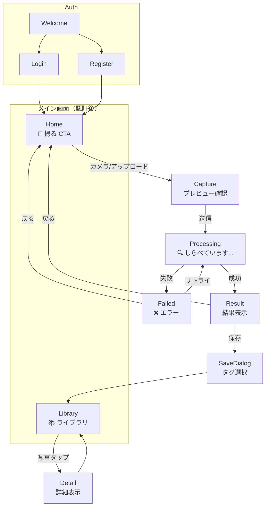

# LensClip UX フロー

## 画面遷移図

## 状態管理

### Observation ステータス
| 状態 | 意味 | UI表現 |
|------|------|--------|
| `processing` | AI分析中 | スピナー + 「しらべています...」 |
| `ready` | 分析完了 | 結果表示画面へ遷移 |
| `failed` | 分析失敗 | エラーメッセージ + リトライボタン |

### ポーリング
- `processing` 中は 1秒間隔でステータス確認
- 最大60秒でタイムアウト → `failed` 扱い

## 画面詳細

### Home
- **大きな「撮る」CTAボタン**（画面中央または下部固定）
- 今日の撮影数（シンプル表示）
- 最近の発見（3枚程度のプレビュー）

### Capture
- カメラプレビュー or ファイル選択
- 確認画面（✕キャンセル / ⭕️送信）

### Processing
- 全画面オーバーレイ
- アニメーションスピナー（🔍 or カスタム）
- 「しらべています...」テキスト

### Result
- **切り抜き画像**（croppedがあれば）
- **タイトル**（大きく表示）
- **子供向け説明**（kid_friendly）
- **豆知識**（fun_facts、折りたたみ可能）
- **安全注意**（safety_notes、あれば目立たせる）
- **タグ候補**（タップで選択/追加）
- 保存ボタン

### Failed
- エラーアイコン + メッセージ
- 「もういちどしらべる」ボタン
- 「もどる」ボタン

### Library
- 写真グリッド（2~4列）
- 検索バー
- タグフィルタ（横スクロール chips）
- 無限スクロール or ページネーション

## ナビゲーション
モバイル下部固定ナビ:
- 🏠 Home
- 📚 Library
