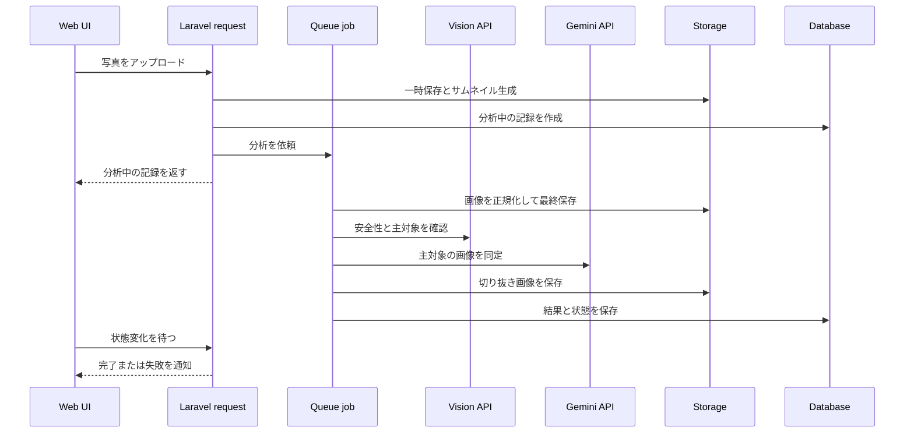

# AI 処理の責務分担

この文書は、画像アップロードから結果保存までの境界と、その設計理由を扱う。処理手順、閾値、プロンプト、レスポンス構造は実装を一次ソースとする。

## 全体像

## 境界の理由

- HTTP リクエストでは、アップロードの受理、即時表示用サムネイル、分析中レコードの作成までを行う
- 画像正規化、外部 AI 呼び出し、切り抜き、結果保存は再実行可能な Job に隔離する
- UI は外部 AI API を直接呼ばず、サーバが認証情報・安全設定・モデル制約を強制する
- 通知は画面更新のきっかけに限定し、永続化されたサーバ状態を最終的な正とする

## 再試行

再試行は新しい記録を作らず、既存記録を分析中へ戻して同じ Job の入口を使う。セキュリティ、モデル制御、EXIF の制約は [security-invariants.md](security-invariants.md) を一次ソースとする。

## 一次ソース

| 関心事 | 一次ソース |
|---|---|
| アップロード検証と受理 | `app/Http/Requests/StoreObservationRequest.php`、`app/Http/Controllers/ObservationController.php` |
| 画像保存・正規化 | `app/Services/ObservationService.php`、`app/Jobs/AnalyzeObservationJob.php` |
| 安全性、対象選定、プロンプト | `app/Services/ImageAnalysisService.php` |
| モデル選択 | `app/Services/GeminiModelRegistry.php`、管理画面の設定処理 |
| TTS とキャッシュ | `app/Services/TtsService.php`、`app/Http/Controllers/TtsController.php` |
| 状態遷移と失敗処理 | `app/Jobs/AnalyzeObservationJob.php` と関連テスト |
