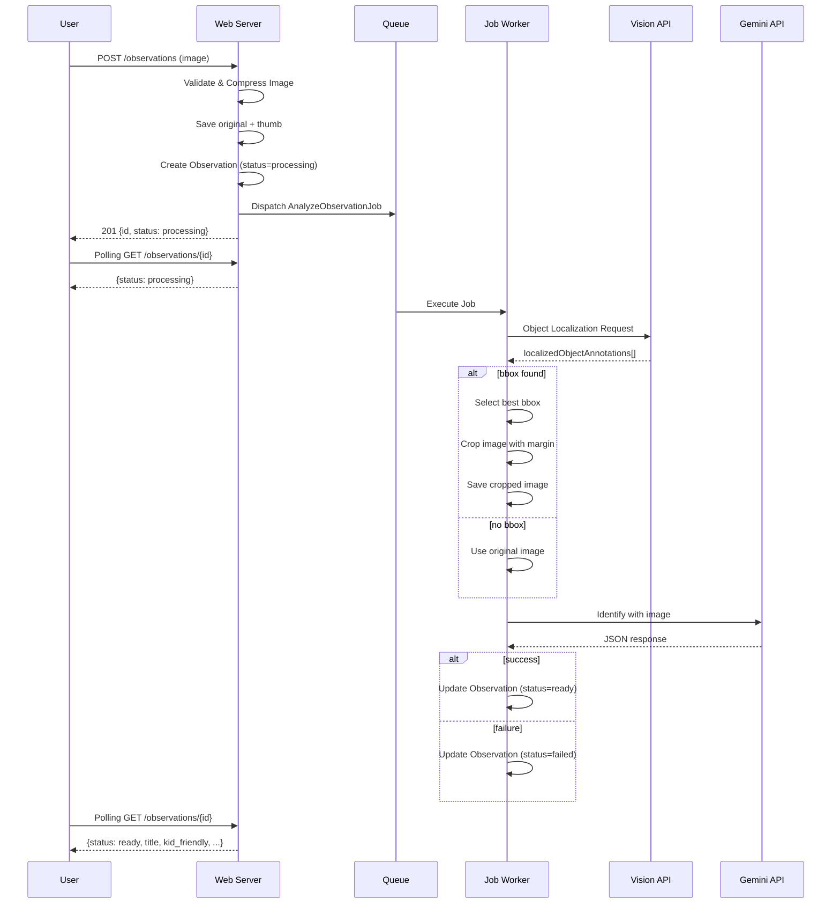

# LensClip AI パイプライン

## 処理フロー



## 1. 画像アップロード

### バリデーション
- MIME: `image/jpeg`, `image/png`, `image/webp`, `image/gif`
- サイズ: 最大 10MB
- 実体検証: ファイルヘッダ確認

### 圧縮・保存
1. **Original**: 最大1024px幅にリサイズ、WebP 80%品質
2. **Thumb**: 300px幅、WebP 70%品質
3. EXIF除去（Intervention Image のデフォルト動作）

### ストレージパス
```
storage/app/public/observations/{random40chars}.webp
storage/app/public/observations/{random40chars}_thumb.webp
storage/app/public/observations/{random40chars}_cropped.webp
```

---

## 2. Vision API (Object Localization)

**認証・接続**: `google/cloud-vision` SDKを使用し、`GOOGLE_APPLICATION_CREDENTIALS` (サービスアカウント) にて認証・リクエストを行います。

### 実装 (SDK)
```php
$client = new ImageAnnotatorClient();
$features = [Type::OBJECT_LOCALIZATION, Type::SAFE_SEARCH_DETECTION];
$response = $client->annotateImage($imageContent, $features);
$localizedObjects = $response->getLocalizedObjectAnnotations();
```

### bbox選定ロジック
複数のオブジェクトが検出された場合、以下のスコアで1つを選定:

```
finalScore = score * 0.5 + areaRatio * 0.3 + centerBonus * 0.2
```

- **score**: Visionの信頼度（0-1）
- **areaRatio**: 画像全体に対するbbox面積比（大きいほど高い、0-1）
- **centerBonus**: bboxの中心が画像中心に近いほど高い（0-1）

---

## 3. 画像切り抜き (Crop)

### マージン付与
- bboxの各辺を10%拡張
- 画像端でクリップ（はみ出し防止）

### 計算式
```php
$margin = 0.1;
$x = max(0, $bbox['x'] - $margin * $width);
$y = max(0, $bbox['y'] - $margin * $height);
$w = min($width - $x, $bbox['w'] + 2 * $margin * $width);
$h = min($height - $y, $bbox['h'] + 2 * $margin * $height);
```

### フォールバック
- bboxが取得できない場合: cropped無しでoriginalをGeminiに送信
- cropped_pathはnullのまま

---

## 4. Gemini API (同定・説明生成)

### リクエスト
```json
{
  "contents": [{
    "parts": [
      { "text": "<prompt>" },
      { "inline_data": { "mime_type": "image/webp", "data": "<base64>" } }
    ]
  }],
  "generationConfig": {
    "response_mime_type": "application/json"
  }
}
```

### プロンプト
カテゴリリストは `config/categories.php` から動的に生成される。
各カテゴリの `description` も付与し、分類精度を向上させている。

```
あなたは子供向け図鑑アプリのAIです。この画像に写っている主な対象を同定し、3-6歳の子供に説明してください。

**重要**: 可能性のある候補を最大3つまで挙げ、それぞれについてカード情報を生成してください。
**必須**: 各候補には必ず「english_name」を含めてください。

以下のJSONフォーマットで返答してください。JSON以外は絶対に含めないでください。

{
  "title": "第1候補の名前（ひらがな/カタカナ推奨）",
  "summary": "第1候補の簡潔な説明（大人向け、100文字以内）",
  "kid_friendly": "第1候補の子供向けのやさしい説明（50文字以内、ひらがな多め）",
  "category": "<config/categories.phpのIDから動的生成>",
  "confidence": 0.0-1.0,
  "tags": ["関連タグ"],
  "safety_notes": ["危険や注意事項があれば"],
  "fun_facts": ["豆知識"],
  "questions": ["子供に聞いてみたい質問"],
  "candidate_cards": [
    {
      "name": "候補の名前",
      "english_name": "english name (required, lowercase)",
      "confidence": 0.0-1.0,
      "summary": "簡潔な説明（大人向け、80文字以内）",
      "kid_friendly": "子供向け説明（40文字以内）",
      "look_for": ["見分けポイント"],
      "fun_facts": ["この候補の豆知識"],
      "questions": ["この候補に関する質問"],
      "tags": ["タグ"]
    }
  ]
}
```

> **カテゴリマスター**: `config/categories.php` が唯一の一次ソース。
> 現在の許可値: `animal`(どうぶつ), `insect`(むし), `plant`(しょくぶつ), `food`(たべもの), `vehicle`(のりもの), `place`(ばしょ), `tool`(どうぐ), `other`(そのほか)

### レスポンスパース
1. `response_mime_type: application/json` で厳格モード
2. フォールバック: markdownコードブロック除去後にパース
3. 失敗時: status=failed、error_message保存

---

## 5. エラーハンドリング

| 状況 | 対応 |
|------|------|
| Vision API エラー | status=failed, 元画像は保持 |
| bbox検出なし | フォールバック（原画像でGemini） |
| Gemini API エラー | status=failed, 元画像は保持 |
| JSONパースエラー | status=failed, 生レスポンスをログ |
| タイムアウト | status=failed |

### リトライ
- `POST /observations/{id}/retry` で同じJobを再投入
- status=failedのものだけリトライ可能
- リトライ前にstatus=processingに更新

---

## 環境変数
```env
# Google Cloud Service Account (for Vision API)
GOOGLE_APPLICATION_CREDENTIALS=service-account.json

# Gemini API Key (for LLM analysis)
GEMINI_API_KEY=your-gemini-api-key
```

> **Note**: Geminiモデルは管理画面 (`/admin/settings/ai`) から変更可能。  
> 許可モデル・デフォルトは [ai-models.md](ai-models.md) を参照（唯一の一次ソース）。