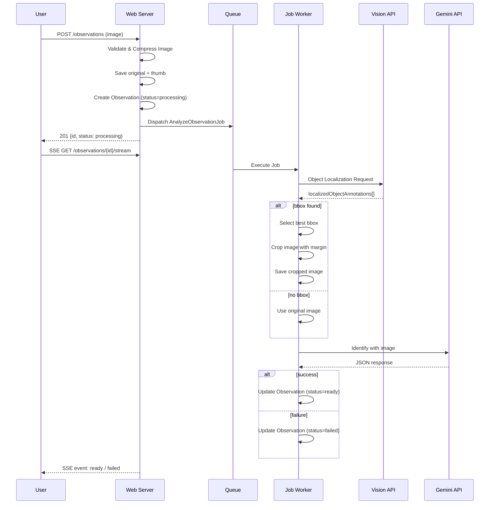
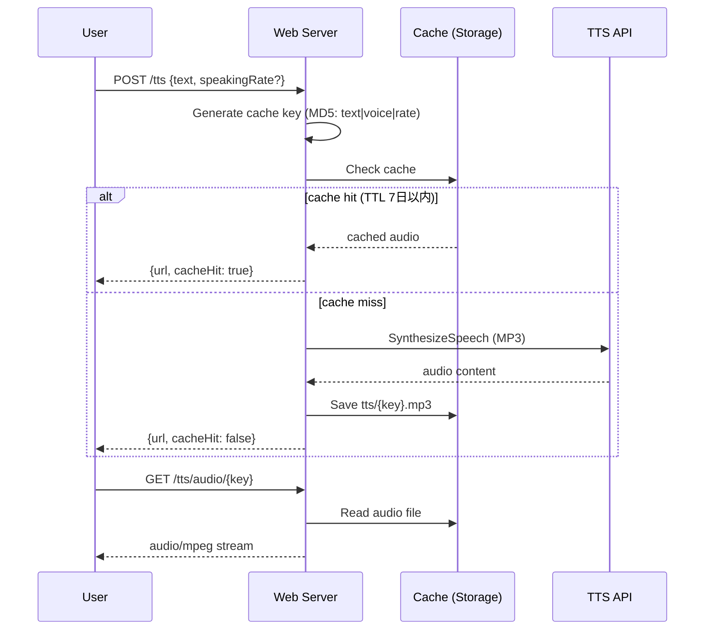

# LensClip AI パイプライン

## 処理フロー


```mermaid
sequenceDiagram
    participant U as User
    participant W as Web Server
    participant Q as Queue
    participant J as Job Worker
    participant V as Vision API
    participant G as Gemini API

    U->>W: POST /observations (image)
    W->>W: Validate & Compress Image
    W->>W: Save original + thumb
    W->>W: Create Observation (status=processing)
    W->>Q: Dispatch AnalyzeObservationJob
    W-->>U: 201 {id, status: processing}

    U->>W: SSE GET /observations/{id}/stream
    
    Q->>J: Execute Job
    J->>V: Object Localization Request
    V-->>J: localizedObjectAnnotations[]

    alt bbox found
        J->>J: Select best bbox
        J->>J: Crop image with margin
        J->>J: Save cropped image
    else no bbox
        J->>J: Use original image
    end

    J->>G: Identify with image
    G-->>J: JSON response

    alt success
        J->>J: Update Observation (status=ready)
    else failure
        J->>J: Update Observation (status=failed)
    end

    W-->>U: SSE event: ready / failed
```

---

## 1. 画像アップロード

### 圧縮・保存
1. **Original**: 最大1024px幅にリサイズ、WebP 80%品質
2. **Thumb**: 300px幅、WebP 70%品質
3. EXIF除去（Intervention Image のデフォルト動作）

保存先: `storage/app/public/observations/{random40chars}[_thumb|_cropped].webp`

---

## 2. Vision API (Object Localization)

`google/cloud-vision` SDK、サービスアカウント認証。

### bbox選定
複数オブジェクト検出時、合成スコアで1件選定:

```
finalScore = score * 0.5 + areaRatio * 0.3 + centerBonus * 0.2
```

- **score**: Vision の信頼度 (0-1)
- **areaRatio**: 画像全体に対する bbox 面積比 (0-1)
- **centerBonus**: bbox 中心が画像中心に近いほど高い (0-1)

---

## 3. Crop

- bbox の各辺を **10% マージン**で拡張、画像端でクリップ
- bbox なしの場合: original をそのまま Gemini に送信（cropped_path = null）

---

## 4. Gemini API (同定・説明生成)

- `response_mime_type: application/json` で構造化 JSON 出力を強制
- プロンプトは `ImageAnalysisService::buildPrompt()` で動的生成
- カテゴリリストは `config/categories.php` から注入
- 最大3候補のカード情報（名前、`english_name`、confidence、子供向け説明、見分けポイント、豆知識）
- パース失敗時: markdown コードブロック除去後に再パース → 失敗なら `status=failed`

> Gemini モデルの allowlist は [ai-models.md](ai-models.md) が唯一の一次ソース。

---

## 5. リトライ

- `POST /observations/{id}/retry` で同じ Job を再投入
- `status=failed` のものだけリトライ可能
- リトライ前に `status=processing` に更新

---

## 6. Text-to-Speech (Google Cloud TTS)

同定結果の英名（`english_name`）を発音読み上げ。英単語学習の補助機能。


```mermaid
sequenceDiagram
    participant U as User
    participant W as Web Server
    participant C as Cache (Storage)
    participant T as TTS API

    U->>W: POST /tts {text, speakingRate?}
    W->>W: Generate cache key (MD5: text|voice|rate)
    W->>C: Check cache

    alt cache hit (TTL 7日以内)
        C-->>W: cached audio
        W-->>U: {url, cacheHit: true}
    else cache miss
        W->>T: SynthesizeSpeech (MP3)
        T-->>W: audio content
        W->>C: Save tts/{key}.mp3
        W-->>U: {url, cacheHit: false}
    end

    U->>W: GET /tts/audio/{key}
    W->>C: Read audio file
    W-->>U: audio/mpeg stream
```

### キャッシュ戦略
- キー: `md5(normalized_text|voice|rate)`
- TTL: 7日（`config/services.php` の `tts.ttl_days`）
- 期限切れは `TtsService::cleanupExpired()` で削除