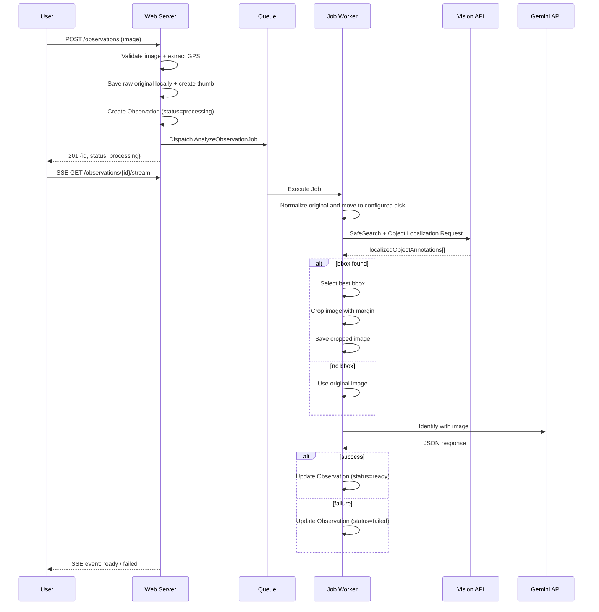
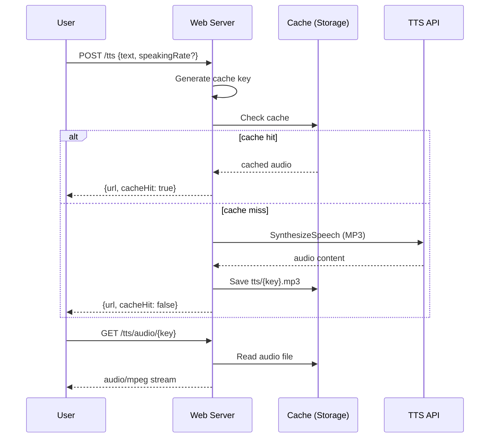

# LensClip AI パイプライン

## 処理フロー

```mermaid
sequenceDiagram
    participant U as User
    participant W as Web Server
    participant Q as Queue
    participant J as Job Worker
    participant V as Vision API
    participant G as Gemini API

    U->>W: POST /observations (image)
    W->>W: Validate image + extract GPS
    W->>W: Save raw original locally + create thumb
    W->>W: Create Observation (status=processing)
    W->>Q: Dispatch AnalyzeObservationJob
    W-->>U: 201 {id, status: processing}

    U->>W: SSE GET /observations/{id}/stream
    
    Q->>J: Execute Job
    J->>J: Normalize original and move to configured disk
    J->>V: SafeSearch + Object Localization Request
    V-->>J: localizedObjectAnnotations[]

    alt bbox found
        J->>J: Select best bbox
        J->>J: Crop image with margin
        J->>J: Save cropped image
    else no bbox
        J->>J: Use original image
    end

    J->>G: Identify with image
    G-->>J: JSON response

    alt success
        J->>J: Update Observation (status=ready)
    else failure
        J->>J: Update Observation (status=failed)
    end

    W-->>U: SSE event: ready / failed
```

---

## 1. 画像アップロード

### 保存
1. FormRequest で画像形式、サイズ、マジックバイト、任意の緯度・経度を検証する
2. サーバ側で EXIF の GPS だけを抽出する
3. HTTP リクエスト中は raw original を local disk に一時保存する
4. thumb は同期生成し、処理中画面で即時表示できるようにする
5. Observation は `processing` で作成し、画像パスには Job 前の local 状態を示す prefix を付ける

original の正規化、EXIF 除去、最終保存先への移動は Job の最初に行う。画像サイズや品質などの具体値は `ObservationService` / `AnalyzeObservationJob` を一次ソースにする。

---

## 2. Vision API (Object Localization)

`google/cloud-vision` SDK、サービスアカウント認証。

Vision では SafeSearch と Object Localization を実行する。不適切コンテンツが検出された場合は Job を失敗状態にし、内部詳細を出さない利用者向けメッセージに変換する。

### bbox選定
複数オブジェクト検出時は、Vision の信頼度、bbox 面積、画面中心への近さを使った合成スコアで1件選ぶ。重みの具体値は `ImageAnalysisService` を一次ソースにする。

---

## 3. Crop

- bbox の各辺をマージン付きで拡張し、画像端でクリップ
- bbox なしの場合: original をそのまま Gemini に送信（cropped_path = null）

---

## 4. Gemini API (同定・説明生成)

- 使用モデルは管理画面で保存した current model を使う。未設定、または allowlist 外の場合は分析を失敗状態にし、別モデルへ自動フォールバックしない
- `response_mime_type: application/json` で構造化 JSON 出力を強制
- プロンプトは `ImageAnalysisService::buildPrompt()` で動的生成
- カテゴリリストは `config/categories.php` から注入
- 候補カード情報（名前、`english_name`、confidence、子供向け説明、見分けポイント、豆知識）
- パース失敗時: markdown コードブロック除去後に再パース → 失敗なら `status=failed`

---

## 5. リトライ

- `POST /observations/{id}/retry` で同じ Job を再投入
- `status=failed` のものだけリトライ可能
- リトライ前に `status=processing` に更新

---

## 6. Text-to-Speech (Google Cloud TTS)

同定結果の英名（`english_name`）を発音読み上げ。英単語学習の補助機能。

```mermaid
sequenceDiagram
    participant U as User
    participant W as Web Server
    participant C as Cache (Storage)
    participant T as TTS API

    U->>W: POST /tts {text, speakingRate?}
    W->>W: Generate cache key
    W->>C: Check cache

    alt cache hit
        C-->>W: cached audio
        W-->>U: {url, cacheHit: true}
    else cache miss
        W->>T: SynthesizeSpeech (MP3)
        T-->>W: audio content
        W->>C: Save tts/{key}.mp3
        W-->>U: {url, cacheHit: false}
    end

    U->>W: GET /tts/audio/{key}
    W->>C: Read audio file
    W-->>U: audio/mpeg stream
```

### キャッシュ戦略
- キーと TTL は `TtsService` と `config/services.php` を一次ソースにする
- 期限切れは `TtsService::cleanupExpired()` で削除

---

*Last updated: 2026-07-09*
