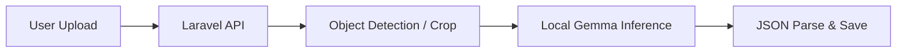

# ローカルLLM（Gemma）運用メモ

> 目的: 画像を外部AI APIへ送らず、ローカル環境で解析を完結させるための検証ガイド。

## ねらい

- 外部APIへの画像送信を避ける（プライバシー・コスト観点）
- 回線混雑時の待ち時間を減らす
- 開発中に API キー依存を減らす

## 前提

- LensClip の画像アップロード先はアプリサーバー（Laravel）であり、**クライアントから見ればアップロード自体は必要**
- ここでの「ローカルLLM」は、Gemini の代わりに **同一ネットワーク上の推論サーバー**を使う構成
- セキュリティ制約（キーをクライアント露出しない等）は既存ルールに従う

## 「重い」の主因はどこ？（最初に切り分け）

体感の遅さは、次の合計時間で決まります。

1. 端末→サーバーアップロード時間
2. キュー待ち時間
3. Vision API（物体検出）
4. LLM同定（Gemini / Gemma）

一般にモバイル回線では **1（アップロード）** が最も支配的になりやすく、
「Visionをローカル化しただけ」では体感改善が小さいケースがあります。

### まず見るべきメトリクス

- upload_ms（HTTP受信完了まで）
- queue_wait_ms（Job開始まで）
- vision_ms
- identify_ms（LLM呼び出し）
- total_ms（readyまで）

> まず計測し、最大ボトルネックを1つずつ潰すのが最短です。

## UX最優先フロー（ご提案の方式）

ご提案の流れは、体感速度を上げる設計として有効です。

1. 端末で撮影
2. 端末内で圧縮
3. Vision（または同等の物体検出）へ投入
4. 検出結果をローカルLLM（Gemma）で同定
5. 解析結果を先にUIへ表示
6. 元画像/サムネイルはキューでサーバーへ非同期アップロード

### 期待できるUX改善

- 「結果が先に出る」ため、待ち時間の主観が短くなる
- 回線が遅くても、解析完了までの体感遅延を抑えやすい
- サーバー混雑時も、最低限の体験（同定結果表示）を維持しやすい

### 実装時の注意（重要）

- **整合性**: 解析結果IDと後送画像IDを必ず紐づける
- **再送制御**: オフライン時は指数バックオフで再送
- **容量制限**: 端末キューの上限（件数/MB）を決める
- **プライバシー**: 端末内一時ファイルのTTL削除を入れる
- **失敗表示**: 画像後送失敗時は「結果は表示済み / 保存待ち」をUIで区別

### 判定

> 「重いと感じにくくなるか？」への回答は **はい（かなり有効）**。
> ただし、上の整合性・再送・端末キュー管理を設計しないと、
> 取りこぼしや二重登録で運用品質が落ちます。

## 推奨アーキテクチャ（段階導入）

1. 既存の Vision API + Crop は維持
2. 同定ステップのみを Gemma に切り替える
3. 品質評価後、必要なら Vision 置き換えを検討

## 実行パターン

### A. 開発PC単体（最小構成）

- Gemma サーバー: `localhost` 起動
- Laravel から `http://127.0.0.1:<port>` へ接続
- ログ監視でレイテンシ計測（P50/P95）

### B. LAN内推論ノード（実運用寄り）

- 推論サーバーを別ホスト化
- Laravel は内部ネットワーク越しに接続
- 逆プロキシでIP制限 + 認証

## 先に決めるべき運用ポリシー

- 受け入れモデルの allowlist（例: Gemma 4 系のみ）
- 最大入力解像度（例: 1024px）
- タイムアウト（例: 30秒）
- フォールバック方針（失敗時に Gemini を使うか、失敗返却するか）

## ボトルネック対策（「重い」を減らす）

- アップロード前圧縮（端末側の解像度上限・品質調整）
- bbox crop 後の再エンコード品質を可変化（混雑時は品質を下げる）
- Vision/LLMのタイムアウト値を分離し、遅延原因を可視化
- 同時推論数の上限設定（キューで平準化）
- 同一画像ハッシュで再解析キャッシュ

## 検証チェックリスト

- 同一画像 100件で平均/95パーセンタイル計測
- Gemini 結果との比較（カテゴリ一致率・タグ妥当性）
- 有害コンテンツ判定の代替策があるか
- 障害時（推論サーバー停止）に `status=failed` へ収束するか

## 既知の注意点

- 画像後送方式では「解析成功・保存失敗」の状態を必ずUI上で区別する
- モバイル回線のボトルネックには、クライアント側の追加圧縮・再送制御も必要
- ローカル推論は GPU メモリ要件と冷却設計に影響を受ける

---

*Last updated: 2026-04-16*
