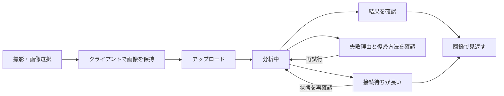

# ユーザーフローと状態遷移

この文書は、複数画面をまたぐ導線と、単一ファイルからは分かりにくい状態の意味だけを扱う。画面項目や見た目は React 実装を一次ソースとする。

## 発見を記録する流れ

- 画像選択からアップロード開始まで、画像本体はクライアント側だけで一時保持する
- アップロード完了後は同じ観察記録を表示したまま、分析結果を待つ
- 分析の失敗は記録の状態として扱い、利用者が再試行できる
- 接続のタイムアウトは分析失敗を意味しない。DB の状態を変えず、再確認または図鑑で待つ導線を出す

## 状態の意味

| 状態 | 利用者にとっての意味 | 許可する復帰 |
|---|---|---|
| `processing` | 写真は保存され、分析結果を待っている | 図鑑へ移動して待てる |
| `ready` | 結果を確認・整理できる | 名前の確定・手動修正、カテゴリの修正、別の撮影 |
| `failed` | 分析を完了できなかった | 同じ記録を再試行、または戻る |

## 待機方式の責務

- 詳細画面で待つ間は SSE で状態変化を受け取る
- SSE の完了通知を受けたら、通知内容を最終データとせずサーバ状態を再取得する
- 図鑑へ移動した後は SSE を維持せず、画面に存在する処理中カードだけを定期確認する
- Home は処理中の記録がある場合だけ、件数と最近の記録を再取得する

権限の不変条件は [security-invariants.md](security-invariants.md)、ルート、ポーリング間隔、イベント形式、画面コンポーネントは `routes/`、Controller、`resources/js/` を一次ソースとする。
