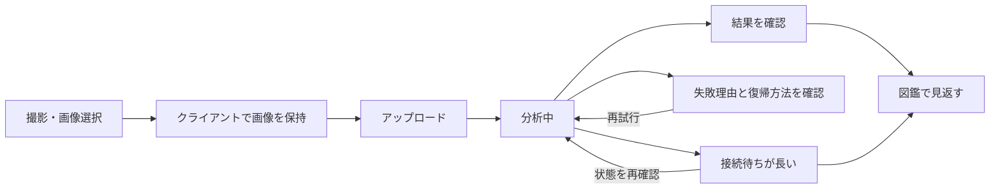

# ユーザーフローと状態遷移

この文書は、複数画面をまたぐ導線と、単一ファイルからは分かりにくい状態の意味だけを扱う。画面項目や見た目は React 実装を一次ソースとする。

## 発見を記録する流れ

```mermaid
flowchart LR
    Find[撮影・画像選択] --> Hold[クライアントで画像を保持]
    Hold --> Upload[アップロード]
    Upload --> Processing[分析中]
    Processing --> Ready[結果を確認]
    Processing --> Failed[失敗理由と復帰方法を確認]
    Processing --> Waiting[接続待ちが長い]
    Failed -->|再試行| Processing
    Waiting -->|状態を再確認| Processing
    Ready --> Library[図鑑で見返す]
    Waiting --> Library
```

- 画像選択からアップロード開始まで、画像本体はクライアント側だけで一時保持する
- 圧縮・送信は画面ではなく同じタブのセッションが管理し、アプリ内の画面移動でも継続する。連続選択は容量・件数を制限した待機列で順番に処理する
- 送信の進捗が完了しても保存済みとは扱わず、サーバの保存確認後に画像メモリを解放する。確認できない場合は写真を保持し、同じ送信として照合・再送する
- サーバでは送信の識別情報を利用者に紐づけて記録する。同じ送信を重複登録せず、削除済み記録を遅れた再送で復活させない
- アップロード完了時は現在の画面に留まり、保存した記録への導線を示す。送信と解析の失敗は区別する
- 一時保持はタブ内のメモリだけで、再読み込み・タブ終了・OSによる終了後の復元は保証しない。離脱警告を永続化の代わりにしない
- ログアウト開始・利用者切り替え時は待機画像を破棄して送信を停止する。既に保存された観察記録の削除は行わない
- 分析の失敗は記録の状態として扱い、利用者が再試行できる
- 接続のタイムアウトは分析失敗を意味しない。DB の状態を変えず、再確認または図鑑で待つ導線を出す

## 状態の意味

| 状態 | 利用者にとっての意味 | 許可する復帰 |
|---|---|---|
| `processing` | 写真は保存され、分析結果を待っている | 図鑑へ移動して待てる |
| `ready` | 結果を確認・整理できる | 名前の確定・表記修正、AI 判定の訂正、カテゴリの修正、別の撮影 |
| `failed` | 分析を完了できなかった | 同じ記録を再試行、または戻る |

## 待機方式の責務

- 詳細画面で待つ間は SSE で状態変化を受け取る
- SSE の完了通知を受けたら、通知内容を最終データとせずサーバ状態を再取得する
- 図鑑へ移動した後は SSE を維持せず、画面の処理中カードと送信完了通知で扱う記録だけを定期確認する。非表示・オフライン中の定期確認は止める
- Home は処理中の記録がある場合だけ、件数と最近の記録を再取得する

## AI 判定を訂正する流れ

- 名前の表記だけを変える操作は、確定済みの説明や豆知識を維持する
- 対象そのものの判定を訂正する操作は、利用者が入力した名前を正として保存し、誤っている可能性のある旧情報を非表示にして関連情報を非同期で再生成する
- 訂正処理に失敗しても入力名は維持し、同じ訂正の再試行または名前だけで図鑑へ残す操作を許可する
- 写真、撮影日時、位置情報、既に付与された節目の種類は訂正によって変更しない。カテゴリの節目は表示カテゴリだけ訂正結果へ追従する

権限の不変条件は [security-invariants.md](security-invariants.md)、ルート、ポーリング間隔、イベント形式、画面コンポーネントは `routes/`、Controller、`resources/js/` を一次ソースとする。
