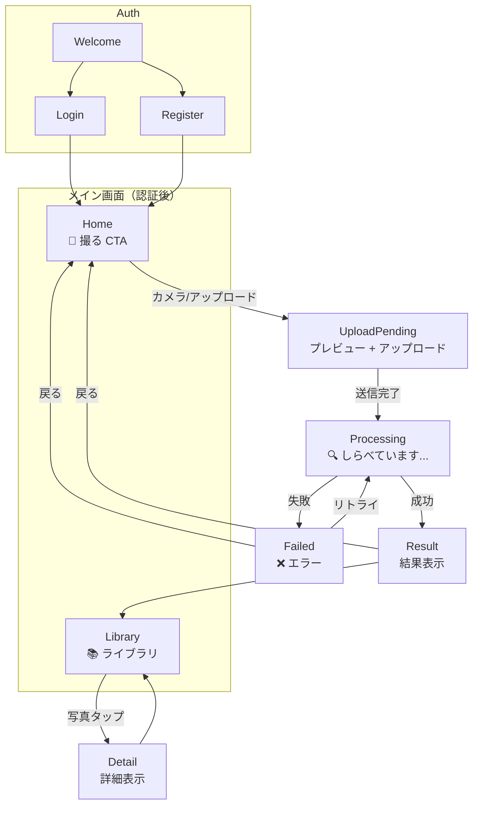

# LensClip UX フロー

## 画面遷移図

## 状態管理

### Observation ステータス
| 状態 | 意味 | UI表現 |
|------|------|--------|
| `processing` | AI分析中 | スピナー + 「しらべています...」 |
| `ready` | 分析完了 | 結果表示画面へ遷移 |
| `failed` | 分析失敗 | エラーメッセージ + リトライボタン |

### SSE（Server-Sent Events）
- `processing` 中は `/observations/{id}/stream` への SSE 接続でステータス監視
- サーバー側は処理中に heartbeat を送信
- `ready` / `failed` / `timeout` イベントで遷移
- 接続がタイムアウトした場合は、画面側で失敗または再確認の導線を出す

## 画面詳細

### Home
- **大きな「撮る」CTAボタン**（画面中央または下部固定）
- 今日の撮影数（シンプル表示）
- 最近の発見（3枚程度のプレビュー）

### UploadPending
- カメラまたはファイル選択後のプレビュー表示
- 位置情報が取得できた場合はアップロード時に緯度・経度を送信
- アップロード中の進捗表示
- 送信後は `Processing` へ遷移

### Processing
- 全画面オーバーレイ
- アニメーションスピナー（🔍 or カスタム）
- 「しらべています...」テキスト

### Result
- **切り抜き画像**（croppedがあれば）
- **タイトル**（大きく表示）
- **カテゴリバッジ**（色付きpill表示、タップで編集モード）
  - 編集モード: 全カテゴリを色付きボタンで並べ、タップで即変更
  - AIが自動分類した結果を親が手動修正可能
  - カテゴリ定義は `config/categories.php` 参照
- **候補カード**（これかも？: 複数候補をタップ切替）
- **発見場所**（緯度・経度がある場合）
- **子供向け説明**（kid_friendly）
- **見分けポイント**（look_for）
- **豆知識**（fun_facts）
- **安全注意**（safety_notes、あれば目立たせる）
- **タグ**

### Failed
- エラーアイコン + メッセージ
- 「もういちどしらべる」ボタン
- 「もどる」ボタン

### Library
- **表示モード切替**: 日付 / カテゴリ / マップ
- 写真グリッド（2~4列）
- 検索バー
- タグフィルタ（横スクロール chips）

**カテゴリビュー** (`?view=category`)
- カテゴリカードをグリッド表示（色付き、サムネプレビュー付き）
- カテゴリタップで絞り込み表示
- カテゴリ定義は `config/categories.php` 参照

## ナビゲーション
モバイル下部固定ナビ:
- 🏠 Home
- 📚 Library
